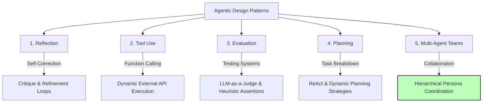

# Agentic AI: Engineering Autonomous, Planning & Multi-Agent Workflows from Scratch

Welcome to the **Agentic AI** portfolio repository! This project represents a highly structured, hands-on engineering exploration into the design, evaluation, and deployment of production-grade agentic architectures. 

Moving beyond basic zero-shot prompting, this repository showcases how to transition Large Language Models (LLMs) into autonomous, reliable, and state-aware agents. It traces a modular learning path starting from single-agent self-correction and tool usage up to complex multi-agent orchestration, dynamic task planning, and culminating in a fully containerized, background-worker capstone system: the **Reflective Research Agent**.

---

## 🛠️ Core Agentic Competencies Demonstrated

* **Orchestration Patterns:** Generation-Reflection Loops, ReAct (Reasoning & Acting) reasoning patterns, Plan-and-Execute architectures, and hierarchical multi-agent teams.
* **Tool-Use & API Dispatch:** Dynamic schema-driven function calling, JSON-based arguments extraction, API validation, and robust exception handling.
* **Rigorous Evaluation:** Automated assertion heuristics, unit testing, and quantitative assessment using **LLM-as-a-Judge** scoring.
* **State & Memory Management:** Shared memory structures, scratchpads, state-transition tracking, and relational database state integration.
* **Full-Stack Agent Deployment:** FastAPI endpoints, Jinja2 template UIs, asynchronous workers, and Dockerized multi-process containerization (Postgres + Python API).

---

## 🏗️ The Five Pillars of Agentic System Design

This repository is organized into five standalone modules, each diving deep into a fundamental architectural pattern:



---

## 📂 Deep Dive: Module Breakdown & Codebase Topics

### 1. Reflection & Self-Correction (`01_reflection_design_pattern`)
*Focus: Build loops where agents continuously evaluate, critique, and improve their own output, dramatically increasing reliability and accuracy.*
* **Concept:** Implementing a recursive feedback loop: **Generator** $\to$ **Reflector/Critic** $\to$ **Refiner**.
* **Key Tasks:** Developing agents that cross-reference draft answers against logical rules or target criteria, automatically self-correcting mistakes before finalizing.
* **Notebooks:** 
  * `C1M2_Assignment.ipynb`: Implement a baseline reflection loop from scratch.
  * `M2_UGL/M2_UGL_1.ipynb`: Core self-reflection mechanics and prompting styles.
  * `M2_UGL/M2_UGL_2.ipynb`: Advanced critique, validation, and multi-step adjustment patterns.

### 2. Functional Tool Integration (`02_tool_use`)
*Focus: Empowering models to act on and query the external world by interfacing with structured databases, files, and web APIs.*
* **Concept:** Function calling, dynamic JSON schema extraction, runtime argument parsing, and structured agent execution.
* **Key Tasks:** 
  * Establishing standard schemas for tools (e.g. tavily, arxiv, wikipedia search).
  * Building a comprehensive, end-to-end custom **Email Service Automation Hub** (`email_servcie/`), mapping LLM outputs to simulated SMTP triggers, querying databases, and executing tools on a mock database server.
* **Notebooks:**
  * `C1M3_Assignment.ipynb`: Mapping LLM intent to external APIs and handling structured arguments.
  * `tool_call_basics/M3_UGL_1.ipynb`: Syntax, schemas, and native dispatch parameters.
  * `email_servcie/M3_UGL_2.ipynb`: Real-world email database integration, dynamic triggers, and structured dispatch routines.

### 3. Systematic Agent Evaluation (`03_evaluation`)
*Focus: Transitioning away from "vibe-checking" prompts to software engineering rigor by designing programmatic evaluations for stochastic agent systems.*
* **Concept:** Programmatic assertions, deterministic validation, and using an advanced LLM as an evaluator (LLM-as-a-Judge) with structured scorecards.
* **Key Tasks:** Validating agent output structure, checking accuracy against ground-truth benchmarks, and creating resilient assertion testing scripts.
* **Notebooks:**
  * `M4_UGL_1.ipynb`: Complete programmatic assessment patterns, prompt evaluation metrics, and scoring algorithms.

### 4. Advanced Planning & State Optimization (`04_planning`)
*Focus: Enabling agents to handle long-horizon, multi-step operations by dynamically breaking down queries, keeping state, and replanning when encountering roadblocks.*
* **Concept:** ReAct loop logic, Plan-and-Execute schedules, and state machine transitions.
* **Key Tasks:** 
  * Implementing a physical-world system wrapper (like a store inventory management agent) utilizing a local JSON database (`store_db.json`).
  * Allowing agents to verify inventory, calculate dynamic costs, log transitions, and adjust their strategy on the fly.
* **Notebooks:**
  * `M5_UGL_1_R.ipynb`: Building planners that decompose complex logic, execute steps, monitor state modifications, and dynamically revise routes.

### 5. Multi-Agent Systems & Team Orchestration (`05_multi_agent`)
*Focus: Solving complex workflows by dividing labor among specialized personas instead of using a single large generalist prompt.*
* **Concept:** Persona segregation, communication routing, and consensus loops.
* **Key Tasks:**
  * Setting up a **Market Research Team** (`market_research_team/`) where separate agents act as **Researcher** (gathering data), **Writer** (composing reports), and **Editor** (critiquing and validating content quality).
  * Handling communication protocol structures and data handoffs.
* **Notebooks:**
  * `C1M5_Assignment.ipynb`: Coordinating multi-agent networks, handoffs, and feedback.
  * `market_research_team/M5_UGL_2.ipynb`: Implementing collaborative research and editing structures.

---

## ⚡ Capstone Project: Production-Ready Reflective Research Agent

To demonstrate how all these concepts harmonize in a production-ready application, see the [reflective-research-agent/](./reflective-research-agent/) directory. This application represents the **zenith** of the repository's modular concepts, merging Planning, Tool Use, Reflection, Multi-Agent Collaboration, and Evaluation into a functional full-stack solution.

```mermaid
sequenceDiagram
    autonumber
    actor User as Client (Web UI)
    participant API as FastAPI Server
    participant DB as PostgreSQL
    participant Plan as Planning Agent
    participant Exec as Executor (executor_agent_step)
    participant Research as Research Agent
    participant Tools as External Tools (APIs)
    participant Writer as Writer Agent
    participant Editor as Editor Agent

    User->>API: POST /generate_report (Query)
    API-->>User: Return 202 (Task ID)
    
    rect rgb(44, 47, 49)
        note right of API: Background thread runs task:
        API->>DB: Log Task Initialized
        API->>Plan: Run planner_agent()
        Plan-->>API: Returns step-by-step plan (up to 7 steps)
        API->>DB: Update Subtask List
        
        loop For each step in the plan
            API->>Exec: Run executor_agent_step()
            alt If step involves "Research"
                Exec->>Research: Run research_agent()
                loop Up to 5 Turns (Tool Execution Loop)
                    Research->>Tools: Call search tool (Tavily/ArXiv/Wiki)
                    Tools-->>Research: Return raw search data / JSON
                    Note over Research: Model reasons & feeds back tool output
                end
                Research-->>Exec: Returns synthesized research findings
            else If step involves "Draft" / "Write"
                Exec->>Writer: Run writer_agent()
                Writer-->>Exec: Returns draft report
            else If step involves "Revise" / "Edit" / "Feedback"
                Exec->>Editor: Run editor_agent()
                Editor-->>Exec: Returns critique & corrections
            end
            Exec-->>API: Returns step output & agent name
            API->>DB: Log progress & state update
        end
        API->>DB: Log Final Status & Report HTML
    end
    
    User->>API: GET /task_progress/{task_id} (Polling)
    API->>DB: Read status
    DB-->>API: Return progress metrics
    API-->>User: Show progress bar in Web UI
```



### 🧬 Synthesis of Core Design Patterns

The Capstone application acts as a single cohesive orchestrator for the patterns explored across this repository:

1. **Strategic Planning:** When a query is received, the `planning_agent.py` takes the prompt and decomposes it into a dynamic list of contextual research steps, storing them inside a relational PostgreSQL state-tracking table.
2. **Robust Tool-Use & Agentic Loop:** Under the hood, the `research_agent` acts as an autonomous tool-using agent. Equipped with specialized wrappers for the **Tavily Search API**, **Wikipedia API**, and **arXiv API**, it determines the best search queries, triggers tool execution, parses raw JSON, and iteratively feeds back the tool responses to the model (up to 5 turns) to synthesize authoritative facts.
3. **Recursive Reflection:** Once findings are assembled, the multi-agent system triggers a **Writer Agent** to compose the draft and an **Editor Agent** to critique, proofread, and verify facts. The content is iteratively rewritten until it meets professional publishing standards.
4. **State Persistence & Multi-Threading:** To keep the web UI highly responsive, task generation is handled in an asynchronous thread. Real-time updates, step percentages, task state transitions, and raw data are logged in a relational database (`PostgreSQL`) so that the user can poll live status bar updates on the frontend.

---

### 📂 Key Codebase Components

* **`main.py`:** The FastAPI application entrypoint. It configures the database, hosts endpoints (`/generate_report`, `/task_progress/{task_id}`, `/task_status/{task_id}`), and renders the interactive Jinja2 HTML dashboard (`/`).
* **`src/planning_agent.py`:** Houses the task decomposition (`planner_agent()`) and task execution (`executor_agent_step()`) engines.
* **`src/agents.py`:** Defines the specialized cognitive personas—housing prompt engines and schemas for the **Researcher**, **Writer**, and **Editor** agents.
* **`src/research_tools.py`:** Clean wrapper implementations for Tavily, Wikipedia, and arXiv searching.
* **`templates/index.html`:** A premium, interactive Bootstrap/Jinja2-based Web UI showing dynamic task tracking, terminal logs, and final rendered HTML research papers.
* **`Dockerfile` & `docker/entrypoint.sh`:** A dev-ready container setup that bootstraps and configures Postgres, prepares database schemas, and launches the Uvicorn web server in a single deployment package.

---

### 🚀 Launching the Capstone App

To launch the reflective research agent dashboard locally:

1. **Prepare Environment:**
   Create a `.env` file in the `reflective-research-agent/` directory:
   ```env
   OPENAI_API_KEY=your-openai-api-key
   TAVILY_API_KEY=your-tavily-api-key
   ```
2. **Build and Start with Docker Compose:**
   ```bash
   cd reflective-research-agent
   docker-compose up --build
   ```
3. **Interact:**
   Open your browser to [http://localhost:8000](http://localhost:8000) to submit prompts, watch the agents collaborate in real-time, and download finalized HTML research papers!