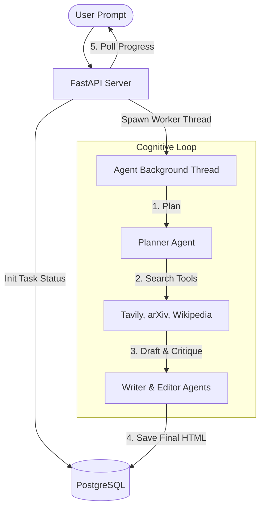

# Reflective Research Agent: Production-Grade Multi-Agent Orchestrator

Welcome to the **Reflective Research Agent**! This application is the flagship capstone project of the **Agentic AI** portfolio repository. It represents a fully integrated, asynchronous, full-stack multi-agent system designed to plan, research, write, and critique comprehensive academic or market research reports.

This project is built using **FastAPI** for the backend, **PostgreSQL** for real-time task state and progress persistence, a beautiful **Bootstrap/Jinja2** interactive frontend, and a fully containerized architecture managed via **Docker Compose**.

---

## 🏗️ Architecture & Component Synthesis

This application acts as a production-grade orchestrator that synthesizes the core agentic patterns covered in this repository:



1. **Dynamic Task Planning (`src/planning_agent.py`):** Decomposes a user query into a sequence of concrete, contextual research objectives (`planner_agent()`).
2. **Dynamic Tool Execution (`src/research_tools.py`):** Equips research agents with Tavily (web search), arXiv (academic papers), and Wikipedia tools, handling structured extraction and parameter parsing.
3. **Multi-Agent Reflection (`src/agents.py`):** Implements a structured **Writer-Editor critique loop**. The Writer drafts reports based on research findings, the Editor critiques the draft, and the Writer refines the content until it meets publication standards.
4. **Relational State & Multi-Threading (`main.py`):** Task generation is handled in an asynchronous thread. Real-time step logs, task progress percentages, and final reports are committed to a PostgreSQL DB, allowing the client UI to poll live updates.

---

## 📂 Project Layout

```
reflective-research-agent/
├── main.py                  # FastAPI server, API routing, and DB connection setup
├── Dockerfile               # Python environment + Debian PostgreSQL bootstrapping
├── docker-compose.yml       # Local development mounting & hot-reload orchestrator
├── requirements.txt         # Project dependencies
├── docker/
│   └── entrypoint.sh        # Startup script initializing Postgres and launching Uvicorn
├── src/
│   ├── planning_agent.py    # Decomposes queries and routes tool executions
│   ├── agents.py            # Prompts and personas for Writer and Editor agents
│   └── research_tools.py    # Tavily, arXiv, and Wikipedia API wrappers
├── templates/
│   └── index.html           # Interactive Bootstrap Jinja2 dashboard UI
└── static/                  # Optional static assets
```

---

## ⚡ Getting Started (Docker Compose)

The easiest way to spin up the entire application (including the FastAPI server and the PostgreSQL database) is using Docker Compose.

### 1. Setup API Keys
Create a `.env` file in this directory (`reflective-research-agent/`):
```env
OPENAI_API_KEY=your-openai-api-key
TAVILY_API_KEY=your-tavily-api-key
```

### 2. Build and Launch
```bash
docker-compose up --build
```

On startup, `docker-compose` will:
* Automatically build the Python environment.
* Boot and initialize a PostgreSQL database instance.
* Create necessary relational tables (`TaskProgress` schema).
* Start the Uvicorn web server at **[http://localhost:8000](http://localhost:8000)**.

---

## 🔌 API Quickstart

### 1. Initiate a Research Task
```bash
curl -X POST http://localhost:8000/generate_report \
  -H "Content-Type: application/json" \
  -d '{"prompt": "Large Language Models for scientific discovery", "model":"openai:gpt-4o"}'
# Response: {"task_id": "UUID-STRING"}
```

### 2. Poll Task Progress
```bash
curl http://localhost:8000/task_progress/<TASK_ID>
```

### 3. Retrieve Completed HTML Report
```bash
curl http://localhost:8000/task_status/<TASK_ID>
```
